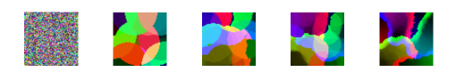

Python implementation of the Epigenetic Robotic Architecture (ERA). It includes standalone classes for Self-Organizing Maps (SOM) and Hebbian Leaning.


What is ERA?
------------

The Epigenetic Robotic Architecture (ERA) is a hybrid behavior-based robotics and neural architecture purposely built to implement embodied principles in cognitive development. This architecture has been already tested in a variety of cognitive and developmental tasks directly modeling child psychology data. The ERA architecture uses a behaviour-based subsumption mechanism to handle the integration of competing sensorimotor input. The learning system is based on an ensemble of pre-trained Self-Organizing Maps (SOMs) connected via Hebbian weights. The basic unit of the ERA architecture is formed by the
structured association of multiple self-organizing maps. Each SOM receives a subset of the input available to that unit and is typically partially prestabilized using random input distributed across the appropriate ranges for those inputs. In the simplest case, the ERA architecture comprises of multiple SOMs, each receiving input from a different sensory modality, and each with a single winning unit. Each of these winning units is then associated to the winning unit of a special “hub” SOM using a bidirectional connection weighted with positive Hebbian learning.

<p align="center">

</p>

In some cases, one of the existing input SOMs can be selected as the hub but more often the hub SOM will provide pattern recognition over the activity of the other SOMs in the ERA unit. Having established the winning units in the various SOMs via a forward pass from the input activity, activity within the ERA unit then spreads via the bidirectional Hebbian connections, allowing the presence of features or concepts in one map to prime features or concepts in the other maps/conceptual spaces. For more information about the architecture see the reference section at the bottom of this page.


Installation
------------

The package does not require any special library, the only requirement is numpy. In the following instruction I suppose that you cloned pyERA in your home folder. To import the pyERA modules it is possible to set the package directory in the $PYTHONPATH from terminal: 

```shell
export PYTHONPATH="${PYTHONPATH}:~/pyERA/pyERA"
```

When you restart the terminal you have to export again the package. Alternatively you can write the same line in your `~/.bashrc` file. You can also load the package directly from python code, inserting the following lines at the beginning of the file:

```python
import sys
sys.path.insert(0, "~/pyERA/pyERA")
```

If the package was correctly added to your $PYTHONPATH you can use it and import the different pyERA modules, for example:

```python
from pyERA.som import Som
from pyERA.utils import ExponentialDecay 
```

Examples
---------

1. How to pre-train a Self-Organizing Map to classify six different RGB colours [[code]](examples/ex_som_colours.py)

<p align="center">

</p>


References
-----------

Morse, A. F., De Greeff, J., Belpeame, T., & Cangelosi, A. (2010). Epigenetic robotics architecture (ERA). IEEE Transactions on Autonomous Mental Development, 2(4), 325-339. [[pdf]](doc/era_epigenetic_robotics_architecture_Morse_et_al_2010.pdf)

