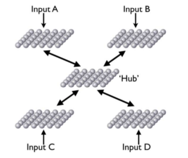
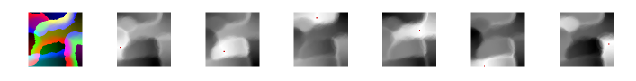

What is pyERA?
------------

pyERA is a python implementation of the Epigenetic Robotic Architecture (ERA). It can be used to create single SOMs or more complex systems interconnected with Hebbian weights. The main features of this library can be summarized as follow:

- Estremely lightweight
- Self-contained, the only external library required is numpy
- Standalone classes for Self-Organizing Maps and Hebbian Leaning
- It provides utilities for decaying learning rate and radius
- Well documented, different examples are provided
- Open source (MIT License)

Because the different modules are standalone you can use pyERA for building SOM using only the som.py class. Feel free to fork the project and add your own stuff. Any feedback is appreciated.

What is a Self-Organizing Map?
------------

A Self-Organizing Map (SOM) is a type of artificial neural network that is trained using unsupervised learning to produce a low-dimensional (typically two-dimensional), discretized representation of the input space of the training samples, called a map. SOMs are different from other artificial neural networks as they apply competitive learning as opposed to error-correction learning (such as backpropagation with gradient descent), and in the sense that they use a neighborhood function to preserve the topological properties of the input space [[wiki]](https://en.wikipedia.org/wiki/Self-organizing_map)


What is ERA?
------------
The Epigenetic Robotic Architecture (ERA) is a hybrid behavior-based robotics and neural architecture purposely built to implement embodied principles in cognitive development. This architecture has been already tested in a variety of cognitive and developmental tasks directly modeling child psychology data. The ERA architecture uses a behaviour-based subsumption mechanism to handle the integration of competing sensorimotor input. The learning system is based on an ensemble of pre-trained SOMs connected via Hebbian weights. The basic unit of the ERA architecture is formed by the
structured association of multiple self-organizing maps. Each SOM receives a subset of the input available to that unit and is typically partially prestabilized using random input distributed across the appropriate ranges for those inputs. In the simplest case, the ERA architecture comprises of multiple SOMs, each receiving input from a different sensory modality, and each with a single winning unit. Each of these winning units is then associated to the winning unit of a special “hub” SOM using a bidirectional connection weighted with positive Hebbian learning.

<p align="center">

</p>

In some cases, one of the existing input SOMs can be selected as the hub but more often the hub SOM will provide pattern recognition over the activity of the other SOMs in the ERA unit. Having established the winning units in the various SOMs via a forward pass, the activity within the ERA unit then spreads via the bidirectional Hebbian connections, allowing the presence of features or concepts in one map to prime features or concepts in the other maps/conceptual spaces. For more information about the architecture see the reference section at the bottom of this page.


Installation
------------

Download the repository from [[here]](https://github.com/mpatacchiola/pyERA/archive/master.zip) or clone it using git:

```shell
git clone https://github.com/mpatacchiola/pyERA.git
```

To install the package you have to run the setup.py script:

```shell
python setup.py install
```

Done! pyERA is installed and ready to be used. You can now give a look to the examples folder. The examples work without any intervention on the code. The only thing you need to do is to open a new terminal in the examples folder:

```shell
cd pyERA/examples/
```

Examples
---------

- How to save and load a Self-Organizing Map [[code]](examples/ex_som_save_load.py)

- How to train a Self-Organizing Map to classify pixel locations [[code]](examples/ex_som_marilyn_monroe.py) [[video]](https://www.youtube.com/watch?v=ipH_Df2MbPI)

<p align="center">

</p>

- How to pre-train a Self-Organizing Map to classify six different RGB colours [[code]](examples/ex_som_colours.py) [[video]](https://www.youtube.com/watch?v=3UOnOpUeZwk)

<p align="center">

</p>

- How to visualize the Euclidean distance between an input vector and the weights of a Self-Organizing Map [[code]](examples/ex_som_activation.py) [[video]](https://www.youtube.com/watch?v=HYGxx-clLRo)

<p align="center">

</p>


References
-----------

Morse, A. F., De Greeff, J., Belpeame, T., & Cangelosi, A. (2010). Epigenetic robotics architecture (ERA). IEEE Transactions on Autonomous Mental Development, 2(4), 325-339. [[pdf]](doc/era_epigenetic_robotics_architecture_Morse_et_al_2010.pdf)


