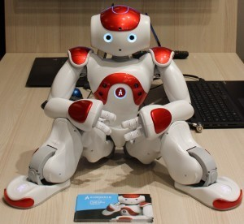

What is motor babbling?
----------------------

Motor babbling is a system of robot learning whereby a robotic system can autonomously develop an internal model of its self-body and its environment. In this example a NAO humanoid robot develops a map of the head movements. The NAO performs some random movements of the head and the feedback from its proprioceptive system is feed back to a Self-Organizing Map (SOM). After 100 random movements a bidimensional representation of the head pose is captured by the SOM. It is possible to visualise the poses using oriented arrows. The lenght of the arrow along the X axis represent the pan movement, whereas the lenght on the Y axis represent the tilt movement.

Prerequisites
------------

It is necessary to have the pynaoqi in the example folder. To obtain pynaoqi it is necessary to login on the Aldebaran website and download the library from the developer session. It is possible to use the robot simulator choregraphe instead of a real robot.

